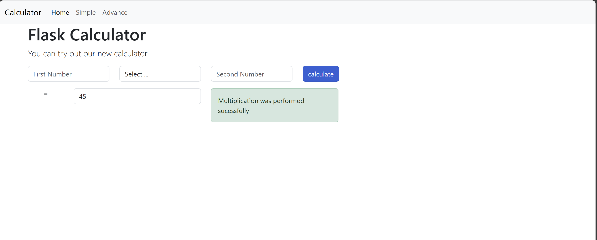
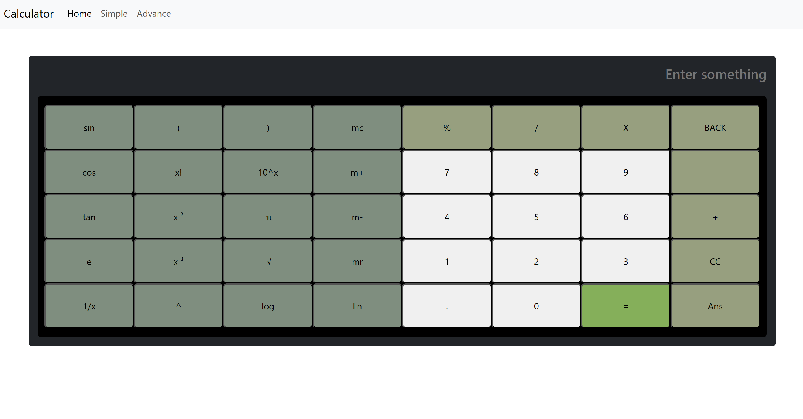

# Scientific Calculator Web App (Flask)

A web-based calculator with:
- 🧾 **Simple Calculator** – Handles +, –, ×, ÷ operations.
- 🧪 **Advance Calculator** – Includes square root and trigonometric functions.
- 📐 **Scientific Calculator** – Mimics real scientifc calculator.

Built using **Flask (Python)** for backend logic, with **HTML/CSS/JS** on the frontend.

---

##  Live Demo

👉 [Try it on Railway](https://web-production-9676f.up.railway.app/)

---

## 🖥️ Features

- 📄 Three dedicated pages:
  - `/basic` → Basic arithmetic
  - `/scientific` → Scientific operations
  - `/trigonometry` → Trigonometric functions
- 🧠 Flask handles all route logic and form submissions
- 🎨 Clean and responsive UI
- 🔄 Backend logic using Python (Flask)
- 💻 Supports both button clicks and keyboard input (optional)

---

## 📸 Screenshots

### Basic Calculator

### Scientific Calculator

